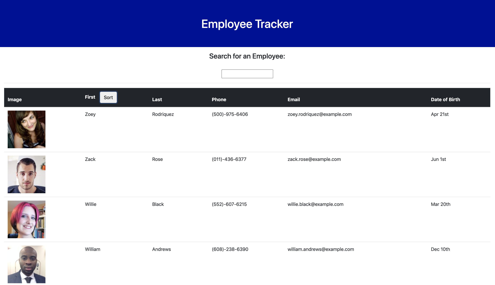

## Employee Tracker

  ****
  ### Description
  Employee Tracker pulls all employees from it's API and displays different information about
  the employees

  
  ### Installation
  Utilize npm install to install node packages
  ```
 npm i 
```
  ### Usage
  Rund node server.js for local usage, or deployed appilication.
  ```
 npm start 
```
## Link to Project
[Weather Dashboard](https://benbknight.github.io/WeatherDashboard/)

## Picture
 

  ### License 
  
  ### Contributing
  Ben Knight - Backend, Trilogy - Front end
  

  